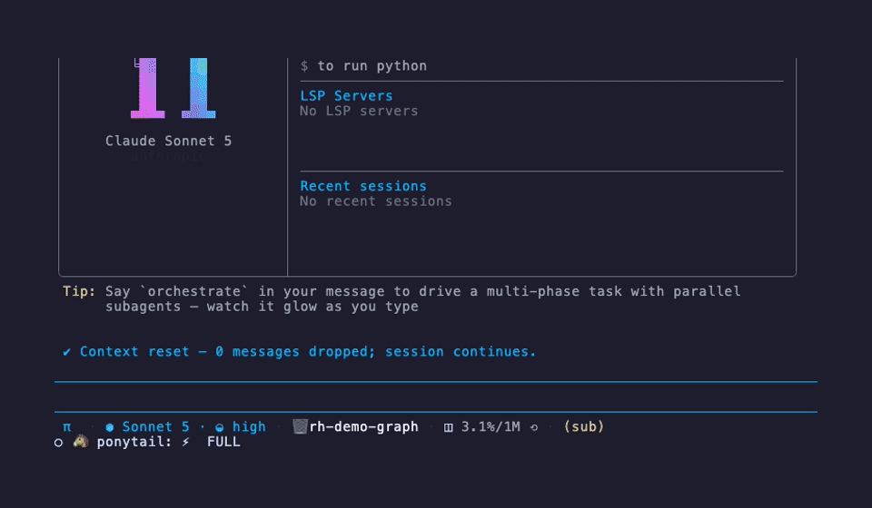

<p align="center"><strong>research-harness</strong></p>

<p align="center">
  A research harness built on oh-my-pi: review literature, grow a second brain of papers, and code — all local-first.
</p>

<p align="center">
  <a href="https://github.com/can1357/oh-my-pi"></a>
  <a href="LICENSE"></a>
  
</p>


One command searches arXiv and OpenAlex, screens candidates against your criteria, fetches open-access PDFs, writes a cited review, and files every included paper into a local knowledge graph.

## Literature review pipeline


```
/litreview LLM agents for radiology report generation — criteria: include only
multi-LLM-agent systems evaluated on radiology tasks; max 8 candidates
```

Three agents run the pipeline: `scholar` searches (arXiv + OpenAlex, keyless), `screener` applies your include/exclude criteria with per-paper rationales, `synthesizer` writes `review-<slug>.md` with citations. Open-access PDFs only — null URLs are skipped, never substituted.

## Second-brain paper graph



Every reviewed paper lands in a local SQLite graph (`~/.research-harness/papers.db`) with typed edges: `cites`, `related`, `same-topic`. `auto-edges` resolves papers on OpenAlex and links them to the papers you already have via `referenced_works` — Connected-Papers style, offline-first.

```sh
pg="python3 research/skills/paper-graph/scripts/paper_graph.py"
$pg add --id bert --title "BERT: ..." --doi 10.18653/v1/N19-1423
$pg auto-edges bert          # cites edges from OpenAlex
$pg neighbors bert --depth 2 # BFS with edge provenance
$pg export --format html     # one-file interactive viz
```


The export is ONE self-contained HTML file — vanilla-JS force-directed canvas, node size by degree, edge colors by type, search, drag/zoom/pan, click for metadata. Zero external URLs; works from `file://` on a plane.

## Everything oh-my-pi has

This is a fork of [can1357/oh-my-pi](https://github.com/can1357/oh-my-pi) — the coding agent with the IDE wired in: 60+ providers, 31 built-in tools, LSP/DAP integration, subagents, and a Rust core. The research layer is purely additive (everything lives under `research/`), so upstream updates merge clean. Upstream's full README is preserved at [docs/UPSTREAM.md](docs/UPSTREAM.md).

## Quickstart

```sh
git clone https://github.com/LaansDole/research-harness
cd research-harness
bun install

# register the research layer with your installed omp
omp plugin install ./research

# bootstrap the research agents and the /litreview command
cp research/agents/*.md ~/.omp/agent/agents/
mkdir -p ~/.omp/agent/prompts && cp research/prompts/litreview.md ~/.omp/agent/prompts/

# run a review
omp -p "/litreview <your question> — criteria: <include/exclude>; max 8 candidates"
```

Requirements: [omp](https://github.com/can1357/oh-my-pi) installed, `python3` (stdlib only — no pip installs), network for arXiv/OpenAlex.

## Credits

- Fork of [can1357/oh-my-pi](https://github.com/can1357/oh-my-pi), itself a fork of [badlogic/pi-mono](https://github.com/badlogic/pi-mono) by [@mariozechner](https://github.com/mariozechner).
- Literature data: [arXiv](https://arxiv.org) export API and [OpenAlex](https://openalex.org) — both keyless; honest User-Agent; open-access sources only.
- Terminal demos rendered with [charmbracelet/vhs](https://github.com/charmbracelet/vhs).
