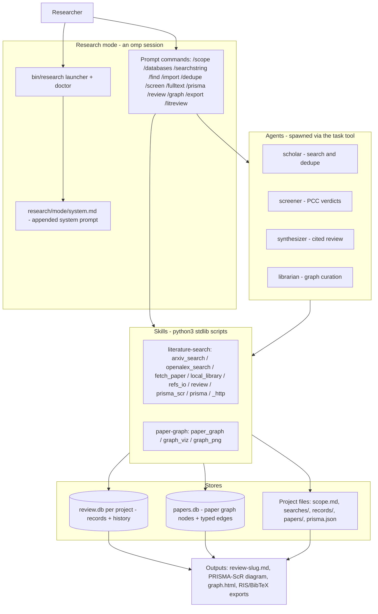

<p align="center"><strong>research-harness</strong></p>

<p align="center">
  A research harness built on oh-my-pi: review literature, grow a second brain of papers, and code — all local-first.
</p>

<p align="center">
  <a href="https://github.com/can1357/oh-my-pi"></a>
  <a href="LICENSE"></a>
  
</p>

![omp TUI: the final turn of a live /litreview run over a 49-file local PDF corpus. The scholar, screener, and synthesizer agents have finished, and the results table reads: Candidates screened 0 -> 4 (from 49-file local corpus scan), Verdicts 4 include / 0 exclude / 0 maybe, Review file review-multi-agent-llm-clinical-feedback.md (~330-word body + refs), PDFs fetched 0 (local corpus, no fetch needed), Paper graph 0 papers / 0 edges -> 4 papers / 6 same-topic edges. The report ends with the requested stats line GRAPH -> 4 papers / 6 edges, and the status bar shows the real session: Sonnet 5, 6.2%/1M context, $0.37.](assets/research/litreview-poster.png)

_[Watch the capture ↗](assets/research/litreview.mp4)_ — recorded before research mode existed: `/litreview` and the paper graph, both still current, but not the mode's command set, `review.db`, or the PRISMA-ScR diagram.

One command — typed in the interactive omp TUI, as recorded above — searches your sources (arXiv + OpenAlex, or a local PDF corpus via `RESEARCH_CORPUS_DIR` for fully offline runs like the demo), screens candidates against your criteria, fetches open-access PDFs, writes a cited review, and files every included paper into a local knowledge graph. `/litreview` is the end-to-end shortcut; the full research mode below breaks the same workflow into researcher-shaped commands.

## Literature review pipeline

```
/litreview LLM agents for radiology report generation — criteria: include only
multi-LLM-agent systems evaluated on radiology tasks; max 8 candidates
```

Three agents run the pipeline: `scholar` searches (arXiv + OpenAlex, keyless), `screener` applies your include/exclude criteria with per-paper rationales, `synthesizer` writes `review-<slug>.md` with citations. Open-access PDFs only — null URLs are skipped, never substituted.

## Research mode

`research` launches omp as a self-contained scoping-review assistant: screening, full-text retrieval, and the PRISMA-ScR diagram all happen in-harness, so Covidence is optional rather than required (`/export` still writes RIS/BibTeX for Covidence, Zotero, or EndNote when you want them). It frames questions as PCC/PICO, recommends databases with rationale (from the skill's `references/DATABASES.md` — coverage, gaps, MeSH vs Emtree vs field-tag syntax), builds ready-to-paste per-database search strings, keeps every PRISMA count derived from per-record states, and proposes the next workflow step after every command.

| Command | Does |
|---|---|
| `/scope <question>` | fuzzy question to PCC/PICO + inclusion/exclusion table; creates the project (or switches to an existing slug) |
| `/databases` | which databases to search for THIS question, with rationale, coverage gaps, and access notes |
| `/searchstring [db]` | ready-to-paste strings in each database's exact syntax (MeSH/Emtree/field tags), recorded under `searches/` |
| `/find` | run what CAN be run: arXiv + OpenAlex + local corpus, via the `scholar` agent |
| `/import <file>` | ingest RIS/BibTeX/CSV/JSONL exports into the per-record review store (`review.db`) with per-database counts; idempotent |
| `/dedupe` | mark duplicates in the store (DOI, then normalized title), survivors keep merged metadata |
| `/screen` | walk the unscreened queue with PCC verdicts per `SCREENING.md` — title/abstract or full-text stage — persisted per record; resumable |
| `/fulltext` | OA-first retrieval cascade: OpenAlex -> Unpaywall -> arXiv -> local corpus -> web-search candidate you approve |
| `/prisma [--format]` | PRISMA-ScR flow diagram DERIVED from record states (text/mermaid/svg/html) |
| `/review` | synthesize a cited review from the includes, via the `synthesizer` agent |
| `/graph` | file the includes into the paper graph and view it inside the terminal (`paper_graph.py view`; inline PNG on Kitty terminals) |
| `/export <ris\|bib>` | write out the includes, all candidates, or the whole graph for Covidence/Zotero/EndNote |
| `/litreview <question>` | **the end-to-end shortcut** — search, screen, fetch, synthesize, graph, in one turn |

Each review lives in its own project under `~/.research-harness/projects/<slug>/` (scope, recorded searches, the `review.db` record store, fetched PDFs), so several reviews can run side by side. A full pass reads: scope -> databases -> searchstring -> find + import -> dedupe -> screen -> fulltext -> prisma -> review -> graph -> export. Paywalled databases are never scraped: the mode writes the strings, you paste them and bring back the exports. Full texts come from open-access sources only — OpenAlex first, then Unpaywall (needs `UNPAYWALL_EMAIL` or `OPENALEX_MAILTO`; skipped rather than faked without one), then arXiv and your corpus, with web search a last resort that hands back a candidate URL for you to approve. A record that resolves to nothing ends as `fulltext_not_retrieved` with a reason — never a guessed link.

## Second-brain paper graph

![omp TUI: the librarian agent has finished growing the paper graph from the local corpus. The before/after table reads: Papers in graph 0 -> 3 (sem-agents, medcoact, sr-mapr), Metadata none -> full (title/authors/year/venue/DOI/OpenAlex ID/abstract/path) per paper, Edges 0 -> 3 same-topic (fully connected triangle), OpenAlex citation edges 0 -> 0 with each paper resolved (27/9/10 references respectively) but none among these 3 nodes, Viz export -> /tmp/rh-demo-graph/graph.html (offline, interactive). Above it, the librarian answers what connects the first two papers: a direct same-topic edge — both do integrated diagnosis+treatment via specialized multi-agent roles with reflection/confidence mechanisms.](assets/research/paper-graph-poster.png)

_[Watch the capture ↗](assets/research/paper-graph.mp4)_ — also recorded before research mode existed; the graph commands shown are unchanged.

In the demo the `librarian` agent grows the graph live from the TUI: corpus scan, add/link with metadata, OpenAlex `auto-edges`, a connection query, and the HTML export. Every reviewed paper lands in a local SQLite graph (`~/.research-harness/papers.db`) with typed edges: `cites`, `related`, `same-topic`. `auto-edges` resolves papers on OpenAlex and links them to the papers you already have via `referenced_works` — Connected-Papers style, offline-first. The same operations are scriptable directly:

```sh
pg="python3 research/skills/paper-graph/scripts/paper_graph.py"
$pg add --id bert --title "BERT: ..." --doi 10.18653/v1/N19-1423
$pg auto-edges bert          # cites edges from OpenAlex
$pg neighbors bert --depth 2 # BFS with edge provenance
$pg export --format html     # one-file interactive viz
```


The export is ONE self-contained HTML file — vanilla-JS force-directed canvas, node size by degree, edge colors by type, search, drag/zoom/pan, click for metadata. No external assets; works from `file://` on a plane, the only outbound links being DOIs in the metadata panel.

## Everything oh-my-pi has

This is a fork of [can1357/oh-my-pi](https://github.com/can1357/oh-my-pi) — the coding agent with the IDE wired in: 60+ providers, 31 built-in tools, LSP/DAP integration, subagents, and a Rust core. The research layer is purely additive (everything lives under `research/`), so upstream updates merge clean. Upstream's full README is preserved at [docs/UPSTREAM.md](docs/UPSTREAM.md).

## Architecture

The research layer is purely additive — mode prompt, 13 prompt commands, four agents, two skills, two SQLite stores plus per-project files, all under `research/` — wired into stock omp through its plugin and agent extension points. The Python is stdlib-only and covered by 91 tests (`bash research/tests/run.sh`). Full design doc: [docs/ARCHITECTURE.md](docs/ARCHITECTURE.md).



## Quickstart

```sh
git clone https://github.com/LaansDole/research-harness
cd research-harness
./setup.sh        # registers the plugin, copies agents + prompts, writes config, symlinks the launcher — idempotent
research doctor   # checks omp, plugin, agents, prompts, corpus, and paper-graph db
research          # exports the research env and starts omp with the mode system prompt appended
```

`bin/research` is a thin launcher: it sources `~/.research-harness/config.env`, exports `RESEARCH_HARNESS_HOME`, `PAPER_GRAPH_DB` (default `~/.research-harness/papers.db`) and `RESEARCH_CORPUS_DIR` when set, then `exec`s your `omp` with `--append-system-prompt research/mode/system.md` — all omp flags pass through. Re-run `./setup.sh` after pulling; new commands reach `~/.omp/agent/prompts/` only when it runs.

Requirements: [omp](https://github.com/can1357/oh-my-pi) installed, `python3` (stdlib only — no pip installs), network for arXiv/OpenAlex (a local corpus works fully offline).

## Credits

- Fork of [can1357/oh-my-pi](https://github.com/can1357/oh-my-pi), itself a fork of [badlogic/pi-mono](https://github.com/badlogic/pi-mono) by [@mariozechner](https://github.com/mariozechner).
- Literature data: [arXiv](https://arxiv.org) export API and [OpenAlex](https://openalex.org) (both keyless), plus [Unpaywall](https://unpaywall.org) for OA locations when a contact email is configured — honest User-Agent; open-access sources only.
- Terminal demos rendered with [charmbracelet/vhs](https://github.com/charmbracelet/vhs).
