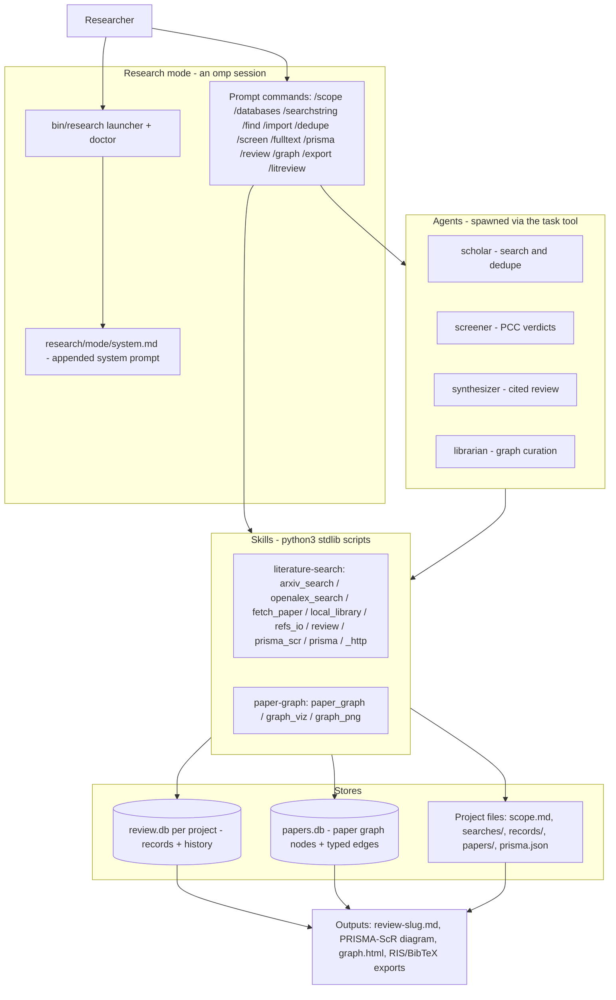
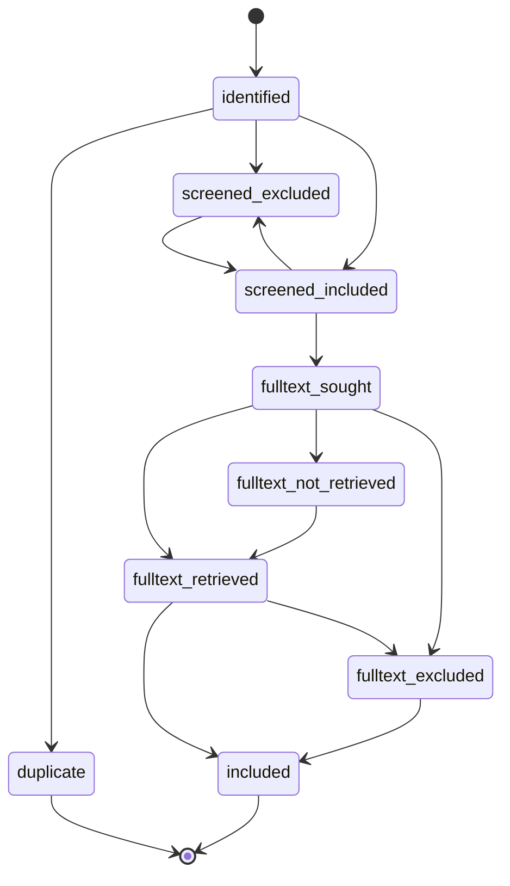

# research-harness architecture

How the scoping-review layer is built, where every piece lives, and the guarantees the design enforces. Written for someone who has never seen the repo.

## Contents

1. [What this is](#1-what-this-is)
2. [Layer map](#2-layer-map)
3. [The research workflow](#3-the-research-workflow)
4. [Data model](#4-data-model)
5. [Retrieval cascade](#5-retrieval-cascade)
6. [Screening methodology](#6-screening-methodology)
7. [Integrity guarantees](#7-integrity-guarantees)
8. [Testing](#8-testing)
9. [Extending it](#9-extending-it)
10. [Known limitations](#10-known-limitations)

## 1. What this is

research-harness is a fork of [can1357/oh-my-pi](https://github.com/can1357/oh-my-pi) (itself a fork of [badlogic/pi-mono](https://github.com/badlogic/pi-mono)) that adds a self-contained scoping-review workflow on top of the omp coding agent: search literature, screen candidates against PCC criteria, retrieve open-access full texts, synthesize a cited review, grow a paper knowledge graph, and emit a PRISMA-ScR flow diagram whose counts are derived from per-record states.

**The core design rule: the research layer is additive.** Everything it adds lives under `research/`, `bin/`, `assets/research/`, and `docs/`. Nothing in `packages/`, `crates/`, or the build config is modified, so upstream omp merges cleanly (the upstream README is preserved verbatim at [docs/UPSTREAM.md](UPSTREAM.md)). The layer plugs into omp through its ordinary extension points — a pi-package plugin (skills + prompt templates), agent definition files, and `--append-system-prompt` — never through code changes.

The scripts are **python3 stdlib only** (no pip installs), and the two machine-queryable web sources — arXiv's export API and OpenAlex — are keyless. A local PDF corpus (`RESEARCH_CORPUS_DIR`) makes the whole pipeline runnable fully offline.



## 2. Layer map

| Component | Path | Responsibility |
|---|---|---|
| pi-package manifest | `research/package.json` | Registers the two skills and thirteen prompt templates with omp (`omp` key, lines 6-23) and upstream pi (`pi` key, lines 24-41) via `omp plugin install` |
| scholar agent | `research/agents/scholar.md` | Read-only search: runs arXiv/OpenAlex scripts and/or scans the local corpus, dedupes, returns ranked candidates as a typed schema |
| screener agent | `research/agents/screener.md` | Applies include/exclude criteria per SCREENING.md; one verdict per candidate, same order as input |
| synthesizer agent | `research/agents/synthesizer.md` | Writes `review-<slug>.md` citing only papers present in its input — never fabricates citations |
| librarian agent | `research/agents/librarian.md` | Curates the paper graph: add/link, OpenAlex auto-edges, connection queries, viz export |
| prompt commands | `research/prompts/*.md` | The 13 `/` commands: `litreview`, `scope`, `databases`, `searchstring`, `find`, `import`, `dedupe`, `screen`, `fulltext`, `review`, `graph`, `prisma`, `export` |
| mode system prompt | `research/mode/system.md` | Operating posture (proactive workflow, OA-only, no paywalled-database scraping), project layout, and per-command semantics |
| launcher | `bin/research` | Loads `~/.research-harness/config.env`, exports `RESEARCH_HARNESS_HOME`/`PAPER_GRAPH_DB`, then `exec omp --append-system-prompt research/mode/system.md` (`bin/research:142-147`); `research doctor` verifies the whole installation (`bin/research:36-128`) |
| setup | `setup.sh` | Idempotent install: `omp plugin install research/`, copies agents/prompts to `$OMP_AGENT_DIR`, creates `~/.research-harness/`, detects the corpus, persists `config.env`, symlinks the launcher onto PATH |
| literature-search skill | `research/skills/literature-search/` | Search, import/export, retrieval, review store, PRISMA rendering (scripts below) |
| — `arxiv_search.py` | `scripts/arxiv_search.py` | arXiv Atom API query → JSON lines; enforces ≥3s between arXiv requests |
| — `openalex_search.py` | `scripts/openalex_search.py` | OpenAlex full-text search → JSON lines; reconstructs abstracts from `abstract_inverted_index` |
| — `local_library.py` | `scripts/local_library.py` | Offline corpus: `scan` a PDF directory into records, `extract` full text (pdftotext → PyMuPDF → stdlib fallback) |
| — `fetch_paper.py` | `scripts/fetch_paper.py` | `fetch` an OA PDF; `resolve` runs the OA-first cascade (section 5) |
| — `refs_io.py` | `scripts/refs_io.py` | RIS/BibTeX/CSV import to the shared record shape; RIS/BibTeX export for Covidence/Zotero/EndNote |
| — `review.py` | `scripts/review.py` | Per-project `review.db`: import, dedupe, screening verdicts, state machine, history, stats |
| — `prisma_scr.py` | `scripts/prisma_scr.py` | PRISMA-ScR flow diagram derived from `review.db` states (text/mermaid/svg/html) |
| — `prisma.py` | `scripts/prisma.py` | Legacy manual count ledger (`prisma.json`) for counts that never became records |
| — `_http.py` | `scripts/_http.py` | Shared HTTP GET with rate-limit-aware retries — the single network chokepoint |
| — references | `references/SCREENING.md`, `references/DATABASES.md` | Screening methodology (source of truth for verdicts) and database selection + per-database search syntax |
| paper-graph skill | `research/skills/paper-graph/` | The second-brain graph |
| — `paper_graph.py` | `scripts/paper_graph.py` | SQLite graph CRUD, BFS neighbors, terminal `view`, OpenAlex `auto-edges`, export |
| — `graph_viz.py` | `scripts/graph_viz.py` | One self-contained offline HTML file: canvas force-directed layout, zero external URLs |
| — `graph_png.py` | `scripts/graph_png.py` | Stdlib PNG rasterizer for inline graph images on Kitty-graphics terminals |
| tests | `research/tests/` | Offline stdlib-unittest suite (`run.sh`, section 8) |

## 3. The research workflow

The mode prompt walks the standard scoping-review pipeline (`research/mode/system.md:44-58`). Each stage: command → agent (if any) → script.

| Stage | Command | Agent | Script / artifact |
|---|---|---|---|
| Scope | `/scope` | — | Writes `scope.md` (PCC/PICO + inclusion/exclusion table); creates the project and sets `active-project` |
| Pick databases | `/databases` | — | Recommendation from `references/DATABASES.md` (coverage, gaps, "no single database is sufficient") |
| Search strings | `/searchstring` | — | Per-database ready-to-paste strings (MeSH/Emtree/field-tag syntax per DATABASES.md); each executed search recorded under `searches/` |
| Find | `/find` | scholar | `arxiv_search.py`, `openalex_search.py`, `local_library.py scan`; records land in `records/` and import into the review store |
| Import | `/import` | — | `review.py import` (RIS/BibTeX/CSV/JSONL → state `identified`, per-source counts); idempotent |
| Dedupe | `/dedupe` | — | `review.py dedupe` — DOI then normalized title; losers become `duplicate` pointing at their survivor |
| Screen (T&A) | `/screen` | screener | `review.py next --stage ta` → verdicts per SCREENING.md → `review.py verdict`; resumable |
| Full-text retrieval | `/fulltext` | — | `fetch_paper.py resolve` cascade (section 5); outcomes recorded on the records |
| Screen (FT) | `/screen` (ft stage) | screener | `review.py verdict --stage ft` — binary, `maybe` banned |
| Synthesize | `/review` | synthesizer | Writes `review-<slug>.md` citing only included papers |
| Graph | `/graph` | librarian | `paper_graph.py add/link/auto-edges/view` |
| PRISMA-ScR | `/prisma` | — | `prisma_scr.py` derived diagram (legacy `prisma.py` only when no `review.db` exists) |
| Export | `/export` | — | `refs_io.py export` (RIS/BibTeX) for Covidence/Zotero/EndNote |
| End-to-end shortcut | `/litreview` | scholar + screener + synthesizer | The whole mini-review in one command (`research/prompts/litreview.md`) |

Paywalled databases (PubMed website, Embase, Scopus, IEEE Xplore, …) are never scraped: the harness emits the search string, the user runs it manually and brings back the export (`research/mode/system.md:9`). The local corpus is read-only (`research/mode/system.md:10`).

## 4. Data model

Three stores, deliberately separate:

- **`review.db`** is per project and per review — the auditable PRISMA-ScR record of one screening pass. It must be isolated so several reviews can run concurrently without cross-contamination.
- **`papers.db`** is the long-lived second brain: papers accumulate across reviews, so it defaults to one global DB (`~/.research-harness/papers.db`, overridable per project with `PAPER_GRAPH_DB`).
- **Project files** are the human-readable artifacts (scope, recorded searches, fetched PDFs, the synthesized review) that outlive any database schema.

### 4.1 Project layout

Each review lives under `~/.research-harness/projects/<slug>/` (`research/mode/system.md:22-34`): `scope.md`, `searches/`, `review.db`, optional `prisma.json` (legacy ledger), optional per-project `papers.db`, `papers/` (fetched PDFs), `records/` (candidate JSONL), and `review-*.md` outputs. The active project slug is the single line in `~/.research-harness/active-project`.

### 4.2 `review.db` — records + history

Schema (`research/skills/literature-search/scripts/review.py:58-93`):

```
records(id PK, import_key, source_db, title, authors, year, venue, doi, url,
        abstract, state, ta_verdict, ta_rationale, ta_confidence, ft_verdict,
        ft_rationale, exclusion_reason, duplicate_of, pdf_path, oa_status,
        oa_source, created_at, updated_at, UNIQUE(source_db, import_key))
history(seq PK AUTOINCREMENT, record_id, from_state, to_state, note, at)
```

The `UNIQUE(source_db, import_key)` constraint (import_key = normalized DOI or normalized title) makes re-importing a file a no-op, while the same paper from a *different* database imports as a new row on purpose — that is exactly what `dedupe` counts for PRISMA.

The nine states (`review.py:31-41`) and legal transitions (`review.py:46-56`):



The sibling edges (`screened_excluded ↔ screened_included`, `fulltext_not_retrieved → fulltext_retrieved`, `fulltext_excluded → included`) let a human overturn a verdict or record a copy found later; `duplicate` and `included` are otherwise terminal (`review.py:43-45`). Every transition is validated against this table and appended to `history` with a UTC timestamp; a full-text verdict issued straight from `screened_included` records the implied `fulltext_sought`/`fulltext_retrieved` hops so the history stays honest (`review.py:191-197`, proven by `test_ft_include_from_screened_included_leaves_honest_history`).

### 4.3 `papers.db` — the paper graph

Schema (`research/skills/paper-graph/scripts/paper_graph.py:25-47`):

```
papers(id PK, title, authors, year, venue, doi, url, abstract, openalex_id, path, added_at)
edges(src → papers ON DELETE CASCADE, dst → papers ON DELETE CASCADE,
      type CHECK(type IN ('cites','related','same-topic')), weight, note,
      PRIMARY KEY (src, dst, type))
```

Three edge types — `cites` (directed), `related`, `same-topic` — enforced by both argparse and the DB CHECK constraint (`paper_graph.py:23`, `paper_graph.py:42`). `path` stores a local-corpus PDF location so offline papers are first-class nodes; `openalex_id` caches the resolved OpenAlex work so repeat `auto-edges` runs skip the lookup. `connect()` migrates pre-existing DBs that lack the two newer columns (`paper_graph.py:63-68`).

### 4.4 `prisma.json` — legacy manual ledger

`prisma.py` maintains hand-entered counts for databases the harness never saw as records. It is the fallback, not the default: `prisma_scr.py` exits 1 with a pointer to it when a project has no `review.db`, and `prisma.py show` prints a `WARNING` line when `included + excluded != screened`.

## 5. Retrieval cascade

`fetch_paper.py resolve` walks an OA-first cascade; the order is a data structure, not scattered ifs (`research/skills/literature-search/scripts/fetch_paper.py:146-152`):

```
STEPS = [openalex, unpaywall, arxiv, local, web_search]
```

| Step | Needs | Yields |
|---|---|---|
| 1. OpenAlex | DOI; keyless (optional `OPENALEX_MAILTO` joins the polite pool via the User-Agent, `fetch_paper.py:29-31`) | `best_oa_location.pdf_url`, else `open_access.oa_url`, plus `oa_status` |
| 2. Unpaywall | DOI **and** a contact email (`UNPAYWALL_EMAIL`, else `OPENALEX_MAILTO`). Neither set → the step is **skipped with a stderr notice**, never a fake address | `best_oa_location.url_for_pdf`, else `url`, plus `oa_status` |
| 3. arXiv | An arXiv id detectable in the DOI (`10.48550/arxiv.*`) or URL (`fetch_paper.py:106-107`) | The canonical `arxiv.org/pdf/<id>` URL — computable offline |
| 4. Local corpus | `RESEARCH_CORPUS_DIR`; matched by DOI, then normalized title | A `pdf_path` inside the corpus — no network |
| 5. Web search (**last**) | Title or DOI | Only a `candidate_url` (a scholar search page) with `needs_human_review: true` — it **never downloads** from an arbitrary host (`fetch_paper.py:137-143`) |

The resolve result records which step won (`oa_source`) and the openness class OpenAlex/Unpaywall reported (`oa_status`: gold/green/hybrid/bronze/closed); when resolving `--id <record> --project <slug>`, both land on the review record via the state machine (`set-state`-equivalent bookkeeping). `fetch` itself requires HTTP 200 and >10 KB (`MIN_BYTES`, `fetch_paper.py:32`) so an HTML landing page saved as "the PDF" fails loudly.

**Hard policy: open-access only.** PDFs come only from OA URLs or the local corpus; shadow libraries are never used (`research/skills/literature-search/SKILL.md:12`, `research/mode/system.md:11`). Closed-access papers end in `fulltext_not_retrieved` with a reason and a human-review candidate URL — no fabricated URLs (regression-tested by `test_closed_access_ends_not_retrieved_with_reason_no_fabricated_url`).

## 6. Screening methodology

`research/skills/literature-search/references/SCREENING.md` is the source of truth; the screener agent and `review.py` both implement it.

- **PCC framing** — criteria are restated as Population / Concept / Context before any candidate is screened; leftovers go under Other (`SCREENING.md:5-13`).
- **Two-stage model** (`SCREENING.md:15-20`): title/abstract allows `include | exclude | maybe` (`maybe` is rare — genuine ambiguity only, and it leaves the record's state unchanged for a human to resolve); full text is **binary** — `review.py verdict --stage ft --verdict maybe` exits 1.
- **No abstract ⇒ exclude** at the T&A stage, rationale "no abstract" (`SCREENING.md:24`).
- **First failed dimension**: every exclude names exactly one primary reason — the first failed dimension in priority order Population → Concept → Context → Other (`SCREENING.md:25`); that reason feeds the PRISMA exclusion breakdowns.
- **Evidence, not echo**: rationales must quote or paraphrase the abstract/full text; "does not meet criteria" is banned (`SCREENING.md:26`).
- **Verdict block** (`SCREENING.md:28-34`): `Verdict: INCLUDE|EXCLUDE|MAYBE — <evidence-based rationale>` plus `Confidence: HIGH|MEDIUM|LOW`. `review.py` stores the labels uppercase and still accepts a legacy 0.0-1.0 float, mapping ≥0.8 HIGH / ≥0.5 MEDIUM / else LOW (`review.py:104-122`).

## 7. Integrity guarantees

| Property | Mechanism |
|---|---|
| PRISMA counts are derived, never hand-typed | `prisma_scr.derive()` computes every box from `review.counts()` state sums and `assert`s the stages reconcile (`research/skills/literature-search/scripts/prisma_scr.py:22-52`, assertion at line 33) |
| Every state change is auditable | `transition()` validates the edge against `ALLOWED` and appends `(record_id, from_state, to_state, note, at)` to `history` (`review.py:167-188`); multi-hop verdicts record the intermediate states too |
| Citations are real | The synthesizer's prompt forbids fabricating citations — it cites only papers present in its input (`research/agents/synthesizer.md`) |
| No fabricated URLs | The cascade's last resort returns a search-page `candidate_url` flagged `needs_human_review`; closed access is recorded as `fulltext_not_retrieved`, never guessed at (`fetch_paper.py:137-143`) |
| Offline-safe graph export | `graph_viz.py` emits one self-contained HTML file — embedded data, inline vanilla-JS canvas, zero external script/style/import sources — asserted by `test_exported_html_is_self_contained` (`research/tests/test_paper_graph.py:110-123`) |
| Rate limits degrade instead of corrupting output | All network calls route through `_http.fetch`: 4 attempts on 429/500/502/503/504 and timeouts, exponential backoff 3s/9s/27s capped at 60s, numeric `Retry-After` honored; retry notices go to stderr so stdout stays pure JSON lines (`research/skills/literature-search/scripts/_http.py:13-15,44-55`) |
| Idempotent ingestion | `UNIQUE(source_db, import_key)` makes re-imports no-ops (`review.py:83`); `dedupe` and `prisma.py` mutations are idempotent; screened records are never demoted by dedupe |
| Bad inputs never crash a run | A malformed RIS/BibTeX/CSV entry is skipped with a stderr note; an unparseable PDF still emits a record with an `extract_error` field |

## 8. Testing

`research/tests/` is a python3 stdlib `unittest` suite — 91 tests, no third-party dependencies:

```sh
bash research/tests/run.sh    # python3 -m unittest discover -s research/tests -v
```

Guarantees built into the harness (`research/tests/helpers.py`):

- **Offline by construction**: `urllib.request.urlopen` is replaced at import time with a guard that raises `NetworkGuard` — a `RuntimeError` on purpose, so `_http`'s retry handler (which catches `URLError`/`OSError`) can never swallow it (`helpers.py:30-40`).
- **Corpus-independent**: every test runs in its own temp dir with env snapshot/restore (`ResearchCase`); the single corpus smoke test is `skipUnless(CORPUS_PDFS)` and skips cleanly when no corpus is configured.

Coverage by file: `test_http.py` (retry/backoff/Retry-After contract), `test_refs_io.py` (RIS/BibTeX/CSV round-trips, malformed-entry resilience, author normalization), `test_review.py` (import idempotence, dedupe rules, every legal and illegal state transition, verdict semantics), `test_prisma_scr.py` (derived-count invariants across state distributions, all four renderers), `test_prisma.py` (legacy ledger + reconciliation warning), `test_fetch_paper.py` (cascade order and record outcomes), `test_local_library.py` (title/author/DOI heuristics, non-PDF safety), `test_paper_graph.py` (round-trip, edge CHECK, view, offline HTML export).

Named regression tests and the bug each guards against:

| Test | Bug |
|---|---|
| `test_regression_single_author_not_split_on_comma` (`test_refs_io.py:63`) | "Kim, Y." was split on the comma into two authors; a comma is part of `Surname, Given` — only `;` separates authors |
| `test_regression_string_authors_not_iterated_as_chars` (`test_refs_io.py:69`, `test_review.py:100`) | A string authors field was iterated character-by-character, exploding one name into single-letter "authors" |
| `test_regression_confidence_accepts_labels` (`test_review.py:264`) | argparse declared `--confidence` as `type=float`, rejecting the documented HIGH/MEDIUM/LOW labels |
| `test_regression_dedupe_count_persists` (`test_prisma.py:49`) | `prisma.py dedupe --count N` was silently ignored: `duplicates_removed` stayed 0 and `screened` never shrank |
| `test_regression_pdf_author_metadata_preferred` (`test_local_library.py:67`) | Distiller-produced embedded objects carried a decoy `/Author` 13 times before the document's own Info dict; the trailer-referenced metadata must win |

## 9. Extending it

- **New command**: add a prompt template `research/prompts/<name>.md` (YAML front matter `description:` + instructions; `$ARGUMENTS` carries the user's text), list it under both the `omp` and `pi` keys in `research/package.json`, and re-run `setup.sh`.
- **New agent**: add `research/agents/<name>.md` (front matter: `name`, `description`, `tools`, `model`, optional typed `output` schema); `setup.sh` copies it into `$OMP_AGENT_DIR/agents/` (it refuses to overwrite the upstream agents listed in `PROTECTED_AGENTS`, `setup.sh:11`).
- **New source**: add a script under `research/skills/literature-search/scripts/` that emits one JSON object per line in the shared record shape (`source, id, doi, title, authors[], year, venue, abstract, url`), routes network I/O through `_http.fetch`, and document it in the skill's `SKILL.md`. A new retrieval step is one `(name, fn)` pair appended in the right position in `fetch_paper.STEPS`.
- **New export format**: extend `refs_io.py export` (record store) or `paper_graph.py export`/`graph_viz.py` (graph) and cover the new format in tests.

Constraints every contributor must respect: **stdlib-only python** (optional binaries like pdftotext may be detected, never required), **additive paths only** (nothing outside `research/`, `bin/`, `assets/research/`, `docs/` — that is what keeps upstream merges conflict-free), **no network in tests** (the `NetworkGuard` will catch you), and **open-access only** (no shadow-library fetches, no scraping paywalled databases, web search yields candidates for human review only).

## 10. Known limitations

- **No PDF mining beyond text extraction.** `local_library.py` extracts text (pdftotext → PyMuPDF → a minimal stdlib fallback that only reads `/Title` metadata); there is no figure/table extraction, no OCR for scanned PDFs, and the stdlib fallback yields an empty abstract.
- **No embeddings or semantic edges.** Graph edges are explicit (`cites` from OpenAlex `referenced_works`, `related`/`same-topic` curated); `search` is SQL `LIKE`, and dedupe/local-corpus matching is exact normalized-title equality — near-duplicate titles (subtitle variants, "Part II") are not caught.
- **Paywalled databases are not queried.** PubMed, Embase, Scopus, IEEE Xplore, etc. are manual: the harness emits ready-to-paste strings and ingests the exports you bring back. Hit counts from those databases enter PRISMA via import counts (or the legacy `prisma.py` ledger), not live queries.
- **Author parsing uses `;` as the only separator** (`refs_io.py:40-48`): a comma is always part of `Surname, Given`, so a comma-separated author list ("Kim Y, Lee J") imports as one author string. Semicolon-delimited exports (RIS `AU` lines, Web of Science CSV) are handled correctly.
- **Corpus scan is non-recursive** — `local_library.py scan` reads `*.pdf` in one directory only; nested corpus folders need one scan per directory.
- **`auto-edges` only links papers already in the graph** — it never imports new nodes, and OpenAlex has empty `referenced_works` for some records (notably bare arXiv preprints), so `references: 0` can mean "no data" rather than "no citations".
- **`review.db` has no multi-reviewer support**: one verdict per stage per record — no dual screening, conflict resolution, or inter-rater agreement (a second reviewer can only overturn via the sibling state edges, which the history records).
